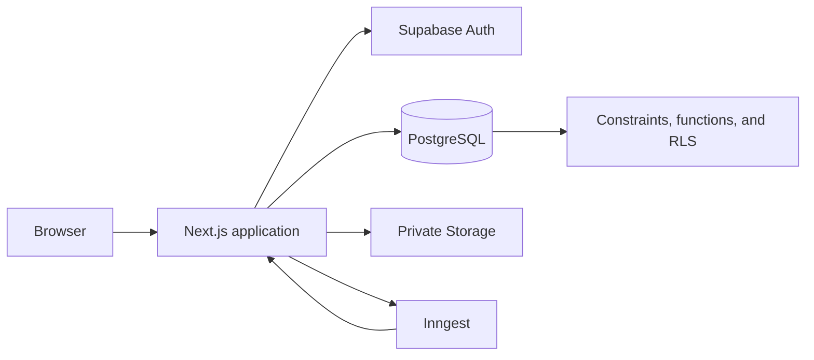

# HR Pulse developer handbook

This handbook explains how HR Pulse is designed and implemented, including the architectural decisions and production concerns behind the code.

The goal is not to memorize every function. The goal is to build a mental model that lets you answer four questions when you open any feature:

1. Where does this request enter the application?
2. Where are identity, organization, and role checked?
3. Where are the business rule and database invariant enforced?
4. What evidence proves the behavior works and remains secure?

## Recommended learning path

Read the chapters in this order the first time:

1. [Architecture](architecture.md) — understand the application shape and why it is a layered monolith.
2. [Local development](local-development.md) — run the complete stack and understand each process.
3. [Request lifecycle](request-lifecycle.md) — follow reads, mutations, route handlers, and background jobs from entry to response.
4. [Authentication and authorization](authentication-and-authorization.md) — learn the identity, organization, role, and ownership boundaries.
5. [Database and security](database-and-security.md) — learn the schema, migrations, Row Level Security, transactions, and concurrency rules.
6. [Frontend and design system](frontend-and-design-system.md) — learn the App Router, server/client component split, forms, responsive UI, and accessibility patterns.
7. [Domain guide](domain-guide.md) — tour payroll, attendance, timecards, time off, self service, operations, and privacy.
8. [Background jobs and operations](background-jobs-and-operations.md) — understand Inngest, private storage, audit history, telemetry, and failure recovery.
9. [Testing and debugging](testing-and-debugging.md) — understand the test pyramid and how to diagnose failures.
10. [Building a feature](building-a-feature.md) — use the same tracer-bullet workflow that shaped the existing features.
11. [Developer glossary](glossary.md) — look up project-specific and architectural terms.

## The application in one paragraph

HR Pulse is one Next.js 16 App Router application. React server components render most pages. Client components provide interaction where browser state is necessary. Server actions handle form mutations. Route handlers provide explicit HTTP endpoints for callbacks, polling, downloads, and Inngest. Supabase supplies authentication, PostgreSQL, and private object storage. Drizzle is the JavaScript query and schema layer, while ordered SQL migrations contain the complete database security and behavior record. Inngest executes payroll and retention work outside the request that initiated it.

## Where to start in the source

| Question | Start here |
| --- | --- |
| How is a page routed? | `src/app/` |
| How does the shared product shell work? | `src/components/app-shell.jsx` |
| How is a user and organization resolved? | `src/auth/access.js` |
| How are roles and employee ownership checked? | `src/lib/authorization.js` |
| What tables exist? | `src/db/schema.js` |
| What does the database actually enforce? | `drizzle/*.sql` |
| How does a domain behave? | `src/<domain>/` |
| Where do forms mutate data? | `src/app/actions/` |
| Where are HTTP endpoints? | `src/app/api/` and `src/app/auth/` |
| Where are background jobs? | `src/inngest/` |
| Where are reusable UI components? | `src/components/ui/` |
| Where are product decisions recorded? | `docs/specs/` |
| Where is delivery scope tracked? | `docs/scope/scope.md` |
| Where are automated tests? | Tests beside source files and `tests/e2e/` |

## How to study one feature

Use attendance as a first code-reading exercise because it is a small, complete vertical slice:

1. Open `src/app/(protected)/attendance/page.js` to see the server-rendered screen.
2. Open `src/app/(protected)/attendance/components/attendance-action-form.jsx` to see the client interaction.
3. Open `src/app/actions/attendance.js` to see the server action boundary.
4. Open `src/attendance/access.js` and `src/attendance/queries.js` to see authorization and reads.
5. Search `drizzle/` for `attendance_check_in` and `attendance_clock_out` to see the transactional database functions and RLS rules.
6. Read `src/app/actions/attendance.test.js` for action-level behavior.
7. Read `tests/e2e/attendance.spec.js` for the real browser, authorization, and concurrency proof.

Repeat that route → component → action → domain → database → test sequence for every other feature.

## Important context

HR Pulse is currently an internal beta. The code intentionally treats payroll and employee data as sensitive, uses feature flags for controlled release, and expects synthetic data during development. The architecture demonstrates production-minded boundaries, but free hosted tiers and a portfolio deployment are not a substitute for production availability, backups, legal review, or regional payroll compliance.

The numbered specifications remain the source of truth for accepted requirements. This handbook explains the implementation and learning model; it does not replace those records.
