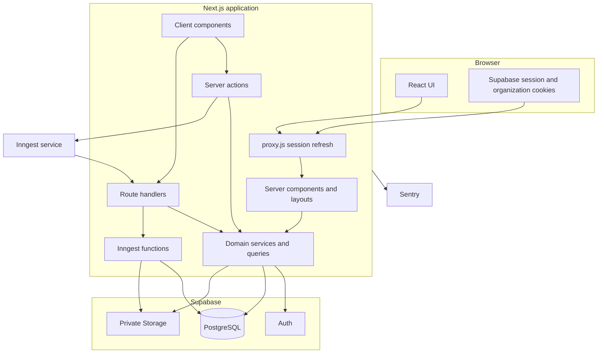

# Architecture

## Why a layered monolith

HR Pulse is a layered monolith: one Next.js deployment contains the UI, HTTP endpoints, application services, and integration boundaries. PostgreSQL, authentication, object storage, background execution, and monitoring remain managed services.

This shape fits the project because the workflows are strongly related. Attendance feeds timecards, approved timecards feed payroll, payroll produces payouts and payslips, and all of them share organization, employee, authorization, audit, and privacy rules. Keeping these workflows in one repository makes transactions, shared contracts, and end-to-end testing easier to understand.

The tradeoff is discipline. A monolith stays maintainable only when route code, business rules, database access, and UI concerns do not collapse into one file. HR Pulse uses directories and dependency direction to preserve those boundaries.

## Runtime view

## Source layers

The dependency direction generally moves downward through this table.

| Layer | Responsibility | Examples |
| --- | --- | --- |
| Route and page | Parse navigation context, render a screen, redirect or return HTTP | `src/app/(protected)/payroll/page.js`, `src/app/api/payroll-runs/route.js` |
| Interactive UI | Browser state, pending state, polling, disclosure, input controls | `payroll-forms.jsx`, `run-polling.jsx`, `sensitive-value.jsx` |
| Mutation boundary | Parse untrusted `FormData`, resolve access, call a service, map safe errors, revalidate | `src/app/actions/` |
| Access boundary | Resolve identity, selected organization, role, and employee ownership | `src/auth/access.js`, domain `access.js` files |
| Domain layer | Business calculations, workflow transitions, queries, idempotency, safe error catalog | `src/payroll/`, `src/time-off/`, `src/overtime/` |
| Shared application layer | Cross-domain authorization, audit, employee helpers, storage | `src/lib/` |
| Persistence layer | Drizzle client, schema objects, validation helpers | `src/db/` |
| Database record | Tables, constraints, indexes, functions, triggers, grants, RLS | `drizzle/*.sql` |
| Async/integration layer | Durable functions and external service adapters | `src/inngest/`, Sentry setup |

Route files should remain thin. They decide how a request enters or leaves the system. Domain files decide what the operation means. SQL migrations decide what must remain true even if application code is wrong or two requests race.

## Four application entry points

### Server-rendered pages

Most `page.js` files are async server components. They can read cookies, load authorized data, and render HTML without shipping their data-access code to the browser. This is the default for dashboard, history, detail, and review pages.

### Server actions

Files under `src/app/actions/` begin with `"use server"`. Forms call these functions without a manually designed JSON endpoint. The action still behaves like a public mutation boundary: every value is untrusted, access is rechecked, and errors returned to the client are intentionally safe.

### Route handlers

`route.js` files expose HTTP behavior when a URL and HTTP contract are useful. HR Pulse uses them for authentication callbacks, employee APIs, payroll creation/status, payslip downloads, and the Inngest endpoint.

### Background functions

Inngest functions run after the initiating browser request. Payroll processing and privacy retention can retry without keeping a browser request open. The database, rather than process memory, owns workflow state.

## Server and client components

Components are server components unless they declare `"use client"`. This is a useful performance and security default:

- Server components may query protected data and keep credentials and domain code off the client bundle.
- Client components are used for browser state, event handlers, effects, transitions, and accessible interactive primitives.
- A server component passes the smallest useful serializable props into a client component.
- A client component never becomes an authorization boundary. Hiding a button is only presentation; the server and database still reject forbidden work.

Examples:

- `src/app/(protected)/attendance/page.js` loads trusted state on the server.
- `attendance-action-form.jsx` manages pending and result UI in the browser.
- `src/app/actions/attendance.js` rechecks access and performs the mutation.

## Domain ownership

Each substantial feature owns a directory under `src/`:

| Domain | Owns |
| --- | --- |
| `auth` | Session identity, profile and membership resolution, safe return paths, auth actions |
| `attendance` | Check-in/out access, daily state, manager review queries, safe telemetry |
| `overtime` | Policy, timecard preparation, evidence allocation, approval, corrections |
| `payroll` | Period calculation, preview, confirmation, queueing, processing, payslips |
| `time-off` | Request lifecycle, decision scope, receipts, events, history |
| `self-service` | Employee-owned profile, approved time, payslips, signed cursors |
| `product-operations` | Audit browsing, milestones, grouped failures, safe operational metrics |
| `privacy` | Consent, deletion requests, legal holds, retention execution |

Common filenames deliberately repeat:

- `access.js` resolves the domain-specific caller context.
- `config.js` owns feature flags and release requirements.
- `errors.js` turns internal failure detail into a stable safe error contract.
- `queries.js` contains authorized read models.
- `service.js` or a domain-specific module owns workflow behavior.
- `telemetry.js` records bounded operational signals without sensitive payloads.

## Architectural rules to preserve

1. Organization scope is included in every protected data path, even when a globally unique ID is also present.
2. Authentication, application authorization, and database RLS are separate checks. Passing one does not imply the others can be skipped.
3. Money is represented as integer minor units, never floating-point currency values.
4. UTC timestamps represent instants; date columns represent organization-local calendar dates.
5. Workflow transitions and immutable snapshots are explicit.
6. Operations that may be retried have idempotency keys, unique constraints, receipts, or deterministic event IDs.
7. Sensitive values do not enter logs, audit metadata, telemetry, URLs, or general error messages.
8. Feature flags control navigation and server behavior. A hidden link alone does not disable a feature.
9. Database migrations are append-only history. Existing migrations are not casually rewritten after use.
10. Tests prove business rules at the cheapest useful layer and use a real browser/database for claims that mocks cannot prove.

## Architectural records

The implementation was built through numbered decisions in `docs/specs/`. Start with:

- `0001-stack-and-architecture` for the stack and deployment shape.
- `0002-core-data-model` for shared entities and invariants.
- `0003-authentication-and-sign-in` for the access model.
- `0004-design-system-ui-foundation` for UI composition and accessibility.
- `0005` through `0011` for each vertical product slice.

Read each spec's `index.md` for the accepted contract, `rationale.md` for alternatives and tradeoffs, and `verify.md` for the intended evidence.
