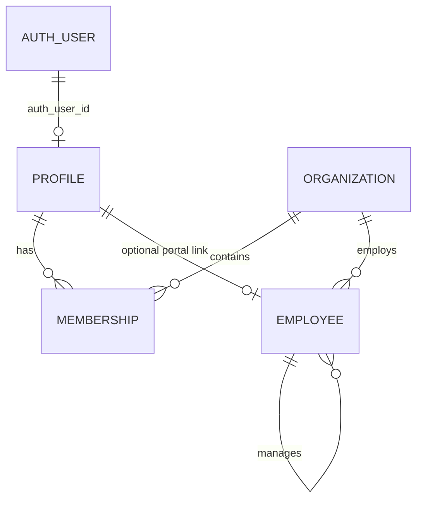

# Authentication and authorization

HR Pulse separates five related ideas that are often mistakenly treated as one:

1. **Authentication** — Supabase proves which Auth user owns the session.
2. **Profile status** — HR Pulse maps the Auth user to an active local profile.
3. **Organization membership** — the profile has an active membership in an active organization.
4. **Role authorization** — that membership has the required employee, manager, or administrator role.
5. **Record ownership or assignment** — the target employee or record is within the caller's allowed scope.

A request is authorized only after all relevant layers pass.

## Identity model



### Supabase Auth user

Supabase owns passwords, sessions, recovery tokens, and the immutable Auth user ID. Application tables do not store password hashes.

### Profile

`profiles` is the local identity record. It maps `auth_user_id` to a display name, email, and application status. An authenticated user without an active profile is intentionally blocked.

### Membership

`memberships` joins a profile to an organization and stores the role and membership status. One profile can belong to multiple organizations.

### Employee

`employees` is the HR record. It can exist without a portal account, so `profile_id` is nullable. When linked, it lets employee-facing workflows prove that the caller owns the target employee record. A manager's employee row is also used to identify direct reports through `manager_id`.

This separation is deliberate. A payroll administrator may have an application profile and membership without being a payroll employee. An employee may be created before portal access is provisioned.

## Session lifecycle

`proxy.js` runs `updateSession` from `src/lib/supabase/proxy.js` for non-static requests. It creates a Supabase server client from request cookies, calls `auth.getUser()` to validate/refresh the session, and returns updated cookies on the response.

The matcher excludes Next.js static files and common asset extensions. The proxy improves session continuity, but it does not grant access to a route.

Server code creates cookie-aware clients through `src/lib/supabase/server.js`. Browser code uses `src/lib/supabase/browser.js`. Administrative fixture and storage operations use the dedicated admin helper; feature code must not create ad hoc service-role clients.

## Sign-in flow

```mermaid
flowchart TD
    Form[Sign-in form] --> Action[signIn server action]
    Action --> Supabase[Supabase signInWithPassword]
    Supabase --> State[getAccessState]
    State --> Profile{Active profile?}
    Profile -- no --> Pending[/pending-access]
    Profile -- yes --> Membership{Active memberships?}
    Membership -- none --> Pending
    Membership -- one --> Cookie[Set selected organization cookie]
    Membership -- many --> Choose[/choose-organization]
    Cookie --> Return[Safe return path]
```

`signIn` in `src/auth/actions.js` returns a generic error for invalid credentials. This avoids revealing whether an email is registered. After authentication it resolves local access and sets `hr_pulse_organization_id` when there is a single membership.

The selected-organization cookie is:

- HTTP-only, so browser JavaScript cannot read it;
- `SameSite=Lax`, reducing cross-site request exposure;
- secure in production;
- only a selection hint, never proof of membership.

Every use of the cookie is followed by a database membership check.

## Access helpers

### `getCurrentUser()`

Calls Supabase `auth.getUser()`. A missing session becomes `user: null`; unexpected Auth errors are not silently treated as anonymous.

### `getAccessState({ organizationId })`

Loads the profile and all active memberships in active organizations. It also left-joins the linked active employee ID. A requested organization is selected only if it appears in those memberships. With no explicit selection, a single available membership is selected automatically.

### `requireOrganizationAccess(organizationId)`

Turns the nullable access state into a required contract. It rejects anonymous users, inactive/missing profiles, and unavailable organizations.

### `resolveOrganizationAccess(...)`

Provides the same core checks for route and service code that already has explicit Supabase and database clients.

### `assertRole(membership, requiredRole)`

Uses the role order employee < manager < administrator. A higher role satisfies a lower role requirement where the domain contract allows it.

### `assertEmployeeAccess(...)`

Checks the target employee:

- administrators can access organization employees;
- managers can access direct reports whose `manager_id` equals the manager's linked employee ID;
- employees can access only the employee row linked to their own profile.

Domain access files add stricter rules when necessary. For example, self service requires an active employee linked to the caller, and product operations requires an administrator plus its release flag.

## Route protection

Protection is layered rather than centralized into one giant middleware rule.

| Layer | Example responsibility |
| --- | --- |
| Root protected layout | Require a signed-in user and active profile |
| Domain layout | Require selected organization, feature flag, and broad role |
| Page | Enforce page-specific state and redirect destination |
| Action/route handler | Re-resolve access for every mutation or HTTP call |
| Domain service | Check record scope and transition rules |
| PostgreSQL RLS/function | Enforce organization/owner scope under concurrency or direct API access |

Examples:

- `payroll/layout.js` admits administrators only.
- `time-off/layout.js` returns 404 when the feature is disabled.
- `self-service/layout.js` requires a linked employee and handles domain-safe availability errors.
- `operations/layout.js` requires the operations feature and administrator context.

Do not rely on layouts for mutation security. A server action can be called independently of a page render, so the action must resolve access again.

## Role capabilities

This table is a developer orientation, not a replacement for domain access code.

| Capability | Employee | Manager | Administrator |
| --- | --- | --- | --- |
| Own attendance | Record and view | If also linked as an employee, domain-dependent | Organization review/correction surfaces |
| Attendance review | No | Direct reports | Organization |
| Own timecard | Prepare, submit, view | Domain-dependent as employee | Organization administration |
| Timecard decisions | No | Direct reports | Fallback/organization scope |
| Own time-off request | Create, view, cancel | Domain-dependent as employee | Organization visibility |
| Time-off decisions | No | Direct reports | Organization fallback |
| Employee/pay setup | No | No | Yes |
| Payroll preview and run | No | No | Yes |
| Self service | Own linked employee data | Only when using own linked employee context | Not as an employee substitute |
| Product operations | No | No | Yes, with feature enabled |
| Privacy settings | Own profile | Own profile | Own profile plus privacy operations |

Always inspect the relevant domain `access.js` before changing a capability.

## Safe return paths

`safeReturnTo` accepts only same-origin relative paths. It rejects excessive length, control characters, backslashes, decoding tricks, and external origins. This prevents an attacker from turning a successful sign-in or callback into an open redirect.

Any new authentication or organization-selection redirect should pass through this helper rather than trusting a `returnTo` query value.

## Password recovery

The recovery request always returns the same confirmation message, whether or not an account exists. The callback supports:

- PKCE `code` exchange, which depends on the verifier cookie from the requesting browser;
- stateless recovery `token_hash` links, which can work across devices when the email template provides that shape.

After the callback establishes a recovery session, the reset page updates the password through Supabase and redirects back to sign in.

## Organization founding

Creating the first organization is intentionally restricted. The Auth user must have `app_metadata.organization_bootstrap === true`, an active provisioned profile, no existing membership, and no previously founded organization. Creation of the organization, administrator membership, payroll schedule, and audit event occurs in one transaction.

## Database defense in depth

RLS policies and authenticated PostgreSQL functions use Supabase's database identity (`auth.uid()`) to rediscover the profile and membership. This protects against:

- direct calls to the Supabase data API;
- a missing application check;
- guessed record IDs from another organization;
- users with inactive profiles or memberships;
- attempts to write tables directly when only a controlled RPC is granted.

The service-role key bypasses RLS. Keep it in server-only setup, fixture, or narrowly reviewed administrative code. Never pass it to a client component, public environment variable, browser test page, URL, or log.

## Checklist for a protected feature

1. Decide the required feature flag, role, employee relationship, and record ownership.
2. Add or reuse a domain context function that resolves the selected organization.
3. Apply the same scope to every read query, including detail-by-ID queries.
4. Recheck access in every action and route handler.
5. Add RLS and grants for direct data/API access.
6. Use organization ID together with record ID in updates and deletes.
7. Test employee, manager, administrator, outside organization, inactive profile, inactive membership, unlinked employee, and anonymous cases where relevant.
8. Confirm safe errors do not reveal that a hidden record exists.
