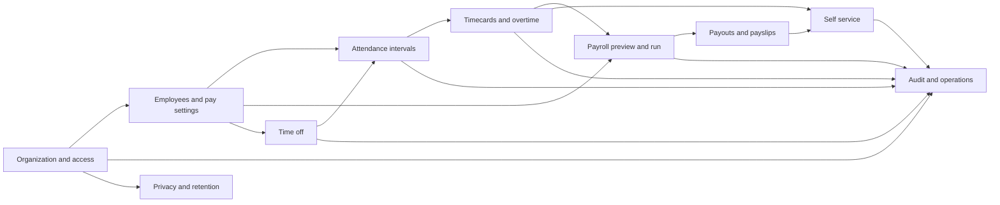

# Domain guide

This chapter maps each product area to its routes, code, data, workflow, and most important invariant. Read it after the architecture and request-lifecycle chapters.

## How the domains connect

## Organization and access foundation

### Purpose

Establish the tenant, local identity, membership, selected organization, and role used by every later domain.

### Main routes

- `/sign-in`, `/forgot-password`, `/reset-password`
- `/auth/callback`
- `/pending-access`, `/choose-organization`
- `/setup/organization`, `/dashboard`

### Main code

- `src/auth/`
- `src/app/actions/organizations.js`
- `src/app/actions/organization-setup.js`
- `src/lib/authorization.js`
- `src/lib/supabase/`

### Flow

Supabase authenticates the user. HR Pulse resolves the local profile and active memberships. A single organization is selected automatically; multiple memberships require an explicit choice stored in an HTTP-only cookie. Organization founding creates the organization, administrator membership, payroll schedule, and audit event in one transaction.

### Invariant to remember

An authenticated Auth user is not automatically an authorized HR Pulse user. Active profile, active membership, active organization, role, and employee linkage remain separate checks.

### What this teaches

Authentication providers identify users; your application still owns authorization and domain identity.

## Attendance

### Purpose

Let an employee create trusted check-in/check-out intervals and let managers or administrators review the organization-local workday.

### Main routes

- `/attendance`
- `/attendance/review`

### Main code

- `src/attendance/`
- `src/app/actions/attendance.js`
- `src/app/(protected)/attendance/`
- attendance migrations beginning with `drizzle/0007_...`

### Flow

1. The page resolves an active linked employee and reads the current attendance state.
2. The client action form invokes a server action.
3. The action calls `attendance_check_in` or `attendance_clock_out` through the caller's Supabase session.
4. The PostgreSQL function validates identity and membership, performs the transition atomically, and writes an audit event.
5. The action maps stable database error codes into safe guidance and revalidates employee/reviewer screens.
6. Review queries group intervals by organization-local date and use stable pagination.

### Important rules

- One employee can have at most one open interval.
- Check-out must occur after check-in.
- Direct table writes are denied; controlled authenticated functions own mutations.
- Employees see their own records; managers see direct reports; administrators see organization scope.
- Concurrent duplicate actions produce one committed transition.
- A lost response does not imply the database failed; the next read reloads authoritative state.

### What this teaches

Use a database transaction/function for small state machines that can race. A UI disabled button cannot prevent two tabs or requests from colliding.

## Overtime and timecards

### Purpose

Convert attendance evidence into a reviewable period snapshot, calculate overtime, and require approval before payroll consumes it.

### Main routes

- `/timecards`
- `/timecards/[id]`
- `/timecards/review`
- `/timecards/admin`

### Main code

- `src/overtime/`
- `src/app/actions/timecards.js`
- `src/app/(protected)/timecards/`
- `drizzle/0009_cooing_grey_gargoyle.sql`

### Flow

1. An employee prepares a timecard for a closed payroll period.
2. The service loads attendance intervals, active overtime policy, and effective pay setting.
3. Interval evidence is split by organization-local day, including midnight boundaries.
4. The calculator determines worked, regular, overtime, payable overtime minutes, and earnings using integer arithmetic and explicit rounding.
5. The timecard stores period totals, per-day snapshots, and exact source allocations.
6. The employee submits the card.
7. A direct manager or administrator fallback approves or returns it.
8. Approved snapshots become immutable payroll evidence and can be consumed only by the appropriate payout.

### Important rules

- Policy and pay inputs are versioned/frozen in the card.
- Attendance corrections invalidate or return affected drafts according to the workflow.
- Approval is not a Boolean field; it is a controlled state transition with an append-only event.
- Version checks and row locks prevent stale reviewers from overwriting each other.
- Payroll uses approved evidence only when the overtime feature is enabled.

### What this teaches

For auditable calculations, store the evidence and configuration that produced the result. Recomputing history from mutable current settings is unsafe.

## Payroll

### Purpose

Configure basic pay, calculate a closed scheduled period, confirm an immutable run, process payouts asynchronously, generate PDF payslips, and expose recoverable status.

### Main routes

- `/payroll`
- `/payroll/setup`
- `/payroll/employees`
- `/payroll/employees/[id]`
- `/payroll/preview`
- `/payroll/runs/[id]`
- `/api/payroll-runs`
- `/api/payroll-runs/[id]/status`
- `/api/payslips/[id]/download`

### Main code

- `src/payroll/`
- `src/app/actions/payroll.js`
- `src/app/(protected)/payroll/`
- `src/inngest/payroll.js`
- `src/lib/storage.js`
- `drizzle/0005_steep_pixie.sql` and corrective payroll migrations

### Setup flow

Administrators manage the payroll schedule, employee records, effective pay settings, flat deduction lines, and role access. The setup checklist derives readiness from actual records rather than a manually checked flag.

### Preview flow

`previewPayroll` selects the most recently closed scheduled period, eligible employees, effective pay settings, deduction lines, and approved timecards when overtime is enabled. It returns rows plus structured blocking issues.

When a preview is valid, the service creates:

- a canonical source document;
- a cryptographic source fingerprint;
- a random preview token whose hash is stored;
- an expiry and calculation version.

The plaintext token is shown only to the confirming flow.

### Confirmation flow

Confirmation runs in a transaction:

1. hash and look up the submitted token;
2. detect an existing run by token or period;
3. lock the organization;
4. reject consumed, expired, wrong-actor, or stale tokens;
5. rebuild the preview and compare fingerprint/calculation version/period;
6. create the frozen run, payouts, deduction lines, earning lines, and pending payslips;
7. consume the preview token and write audit history.

This prevents a pay-setting edit between preview and confirmation from silently changing the confirmed run.

### Processing flow

The action submits a deterministic Inngest event containing run ID, organization ID, generation, and event version. The worker claims the run under locks and lease/generation checks, processes payout snapshots in bounded batches, generates PDFs, uploads them to private Storage, and marks final states. Attempts and progress are persisted for diagnosis and recovery.

### Important rules

- Money uses integer minor units.
- The run currency must match the organization/pay inputs.
- Deductions cannot make net pay invalid.
- Only one run owns a scheduled period.
- Confirmation is atomic and idempotent.
- Completed runs, finalized payouts, and generated payslips are immutable.
- Storage paths and signed links are sensitive and excluded from logs/audit metadata.
- Signed downloads are short-lived and authorized at request time.

### What this teaches

High-value workflows need a two-step contract. Preview gives a human a reviewable result; confirmation proves that the inputs are still the same; asynchronous processing executes the durable work.

## Time off

### Purpose

Let employees submit date-based requests, let authorized reviewers decide them, preserve workflow history, and show approved leave alongside attendance review.

### Main routes

- `/time-off`
- `/time-off/[id]`
- `/time-off/review`
- `/time-off/review/[id]`

### Main code

- `src/time-off/`
- `src/app/actions/time-off.js`
- `src/app/(protected)/time-off/`
- migrations `0010` through `0028` for workflow and hardening

### Flow

1. An active linked employee submits leave type, inclusive local dates, and optional reason.
2. Domain validation checks text, employment dates, date order, overlap, and current lifecycle.
3. Database functions create the request, event, receipt, audit record, and safe result atomically.
4. Reviewer queues scope managers to direct reports and administrators to organization fallback.
5. A reviewer approves or declines under row locks and status guards.
6. An employee can cancel only in allowed states/time windows.
7. Approved dates are read as leave markers in attendance context. Attendance can report partial recovery if leave enrichment fails without hiding trusted intervals.

### Important rules

- Requests use organization-local dates, not arbitrary UTC instants.
- Overlap and status checks are concurrency-safe.
- Mutation receipts distinguish exact replay from conflicting reuse.
- Events are append-only and safe for both employee and reviewer history.
- Review notes/reasons are not copied into broad queues or telemetry.
- Approved leave effects on timecard/payroll are currently deferred; the marker is informational for attendance.

### What this teaches

Retry safety is a user experience feature. Users should be able to resubmit after a network failure without creating duplicate requests or duplicate decisions.

## Employee self service

### Purpose

Give a linked employee a focused owner-only view of editable contact details, approved timecards, and generated payslips.

### Main routes

- `/self-service`
- `/self-service/profile`
- `/self-service/time`
- `/self-service/time/[id]`
- `/self-service/payslips`
- `/self-service/payslips/[id]`

### Main code

- `src/self-service/`
- `src/app/actions/self-service.js`
- `src/app/(protected)/self-service/`
- `drizzle/0029_employee_self_service.sql`

### Flow

`requireSelfServiceContext` requires the feature, active selected organization, and active employee linked to the caller's profile. Queries always combine organization ID, employee ID, final workflow status, and immutable/final flags.

Profile updates call a controlled database function with expected version and request ID. Only preferred name and phone are editable. Employment and payroll fields remain administrator-owned.

History cursors are HMAC-signed, expire after 15 minutes, and are bound to organization, employee, list kind, and status. Payslip details use masked values where appropriate; downloads run through a separately authorized route and short-lived Storage URL.

### Important rules

- An employee sees only their linked employee record.
- Only approved timecards appear.
- Only completed-run, finalized-payout, generated, immutable payslips appear.
- Profile writes use optimistic version checks and retry identity.
- Independent home-card failures are isolated so one unavailable read does not hide all self-service content.

### What this teaches

Read models should encode the complete release contract. A payslip existing in a table is insufficient; every upstream final-state condition must also be true.

## Product operations and audit history

### Purpose

Give administrators safe visibility into important changes, product adoption, queue health, and grouped failures without exposing employee or payroll payloads.

### Main routes

- `/operations`
- `/operations/audit`
- `/operations/audit/[id]`

### Main code

- `src/product-operations/`
- `src/lib/audit.js`
- `src/app/(protected)/operations/`
- migrations `0030` through `0036`

### Flow

Feature domains write allow-listed audit actions and safe metadata. Product milestones are consent-aware and deduplicated. Operational failures are grouped by organization, operation, safe code, and affected entity context so repeated failures increase a count rather than copying raw exceptions.

Administrator queries use stable signed cursors and catalog filters. UI shows safe actor labels, time, action, entity, result, correlation, and recovery destination where one exists.

### Important rules

- Audit history is append-only.
- Catalogs constrain actions, entity types, operations, and codes.
- Metadata excludes names, emails, phone numbers, pay amounts, notes, request bodies, stack traces, storage paths, signed links, and document content.
- Telemetry failure must not make a successful business mutation fail where the integration is best-effort.

### What this teaches

Observability should answer operational questions without becoming an uncontrolled copy of sensitive domain data.

## Privacy, retention, and consent

### Purpose

Publish versioned notices, record analytics consent, manage deletion requests and legal holds, and execute retention/deletion rules safely.

### Main routes

- `/privacy`, `/terms`
- `/settings/privacy`
- `/admin/privacy`

### Main code

- `src/privacy/`
- `src/content/privacy/`
- `src/app/actions/privacy.js`
- `src/app/(protected)/settings/privacy/`
- `src/app/(protected)/admin/privacy/`
- `src/inngest/privacy.js`
- migrations `0037` through `0040`

### Flow

Public notices come from versioned checked-in content and a manifest. Authenticated users may grant or withdraw nonessential product-analytics consent. Every consent change supersedes the previous active row but preserves history.

Employees can submit or withdraw deletion requests. Administrators move requests through review and decision states and can place profile-scoped legal holds. The daily retention job discovers eligible work, claims deterministic execution records, removes or de-identifies permitted data in dependency order, and preserves protected financial/audit records according to policy.

### Important rules

- No nonessential analytics event is written without active consent.
- Analytics identifiers are pseudonymous and secret-derived.
- One open deletion request is allowed per profile/organization.
- Legal holds block deletion of protected profile data.
- Retention execution is idempotent and records counts/failure codes without copying deleted values.
- Financial, security, and audit obligations may require preservation or de-identification rather than simple cascading deletion.

### What this teaches

Deletion is a workflow, not a `DELETE FROM users` button. Identity, employment, financial, audit, consent, and storage data have different ownership and retention constraints.

## Cross-domain rules

When changing one domain, inspect its consumers:

- Employee and pay-setting changes affect timecards and payroll preview fingerprints.
- Attendance corrections affect draft/returned timecards.
- Approved timecards become payroll evidence and self-service history.
- Payroll completion creates self-service payslips and operations events.
- Time-off approval enriches attendance review but does not currently alter payroll.
- Privacy retention must understand records owned by every other domain.
- Feature flags affect navigation, pages, actions, background writes, and production startup assumptions.

A local change can be syntactically isolated while still changing a downstream contract. Search table and exported function usages before editing a shared record.
