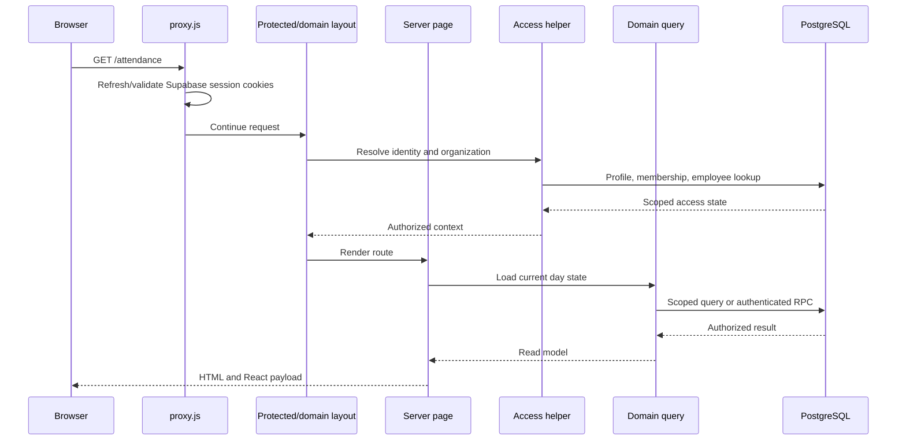
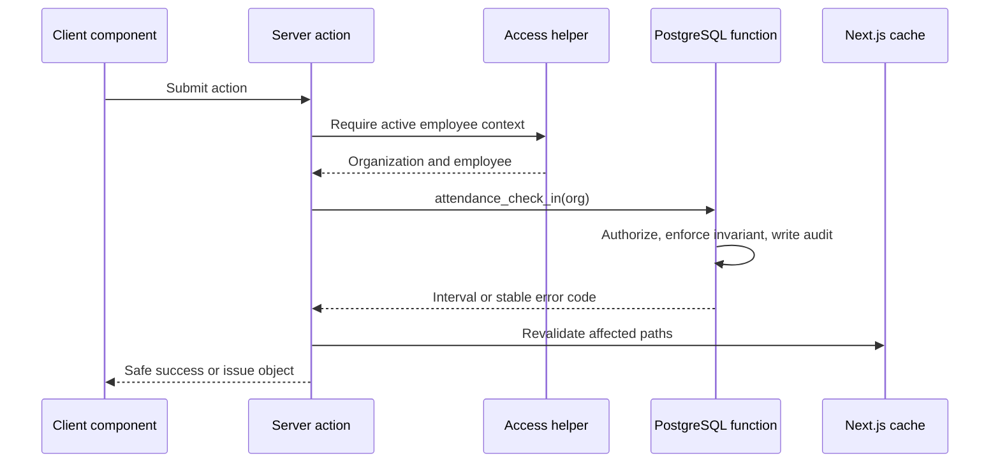
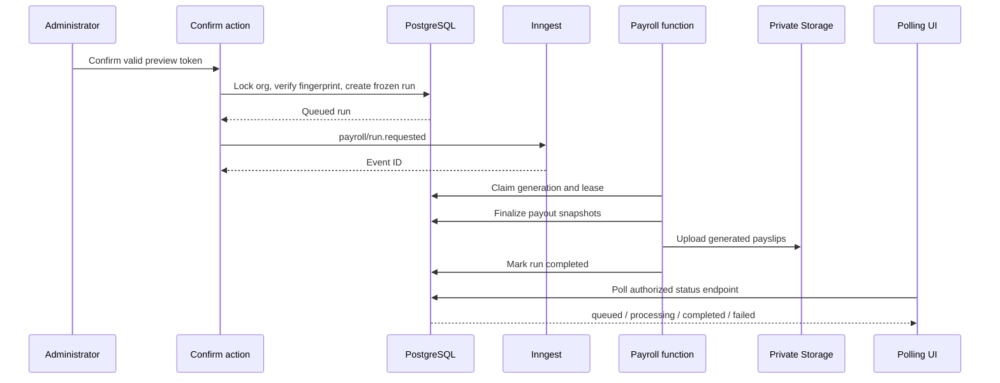

# Request lifecycle

HR Pulse has four main execution paths. Understanding them makes the rest of the code much easier to follow.

## 1. Server-rendered read

Example: opening the attendance page.

The important point is that a URL parameter or cookie is only a requested context. `getAccessState`, `requireOrganizationAccess`, or a domain `require...Context` function proves that the signed-in profile may use it.

## 2. Server-action mutation

Example: an employee checks in.

1. `AttendanceActionForm` is a client component because it owns pending and success UI.
2. The form invokes `checkInAttendance` in `src/app/actions/attendance.js`.
3. The action calls the attendance access helper to resolve the current user, organization, and linked employee.
4. The action calls the authenticated PostgreSQL function through `context.supabase.rpc(...)`.
5. The database function checks the authenticated identity and organization scope, locks or constrains the relevant state, writes the interval and audit event, and rejects invalid concurrent actions.
6. The action maps database failures into the safe attendance error catalog.
7. `revalidatePath` invalidates the employee and reviewer pages.
8. The client component renders the returned safe state.

Why use a database function here? Check-in is concurrency-sensitive. A browser could send two requests, two tabs could race, or the response could be lost after the commit. The database is the only layer that can atomically decide whether an open interval already exists.

## 3. Route-handler request

Example: payroll status polling.

`RunPolling` is a client component that fetches `/api/payroll-runs/[id]/status`. The route handler:

1. validates the run ID;
2. resolves the selected organization and administrator access;
3. loads only the run belonging to that organization;
4. returns a small status document;
5. avoids exposing internal failure detail.

Route handlers are useful when the browser needs a conventional HTTP endpoint, an external service needs a callback URL, or the response is a download/redirect rather than a form state.

Current route-handler categories include:

- Supabase authentication callback under `src/app/auth/callback/route.js`;
- employee and payroll JSON APIs under `src/app/api/`;
- polling under `src/app/api/payroll-runs/[id]/status/route.js`;
- payslip download authorization under `src/app/api/payslips/[id]/download/route.js`;
- Inngest's signed execution endpoint under `src/app/api/inngest/route.js`.

## 4. Background workflow

Example: confirming and processing payroll.

The browser request creates durable intent; it does not perform all payroll work. The queued run, generation number, lease, attempts, and frozen source data let a later worker retry safely.

## How untrusted input moves inward

At each boundary, input becomes more trusted only after a specific check:

| Input | Boundary check | Result |
| --- | --- | --- |
| URL/search parameter | length, type, UUID/date/cursor parsing | syntactically valid value |
| Cookie organization ID | membership lookup for active profile and organization | selected organization context |
| Form field | trim, enum/range/format validation | validated command input |
| Auth user ID | `profiles.auth_user_id` lookup | local application identity |
| Employee ID | organization and role/ownership check | authorized target |
| Workflow status | transaction lock plus allowed transition | valid state change |
| Retry key | unique constraint or receipt comparison | new operation, replay, or conflict |

Validation is not authorization. A valid UUID can still point to another organization. Authorization is not integrity. An authorized administrator can still submit a stale payroll preview. The code checks each concern separately.

## Error flow

Domain errors use stable codes such as `PREVIEW_STALE`, `SELF_SERVICE_INVALID_CURSOR`, or time-off error codes. The safe serialization layer maps those codes to user-facing messages and retry guidance.

Unexpected exceptions may be captured by Sentry and recorded as safe operational failures, but raw stack traces, SQL messages, employee data, pay amounts, request bodies, storage paths, and signed URLs are not returned to the user or copied into audit metadata.

## Cache and refresh behavior

After a successful server action, the action calls `revalidatePath` for every screen whose server-rendered data may now be stale. Client polling uses `router.refresh()` when server state changes. These mechanisms cause server components to load fresh authorized data; they do not replace database transactions or client pending states.

## A code-reading checklist

For any request, locate these pieces:

1. Entry: page, action, or route handler.
2. Parsing: where strings become typed domain values.
3. Access: identity, selected organization, role, and ownership checks.
4. Domain rule: calculator, transition function, or service.
5. Persistence: Drizzle query, transaction, or RPC.
6. Integrity: constraint, lock, trigger, RLS policy, or idempotency record.
7. Response: rendered page, action state, JSON, redirect, or signed URL.
8. Evidence: unit test, integration test, browser journey, and migration verification.
